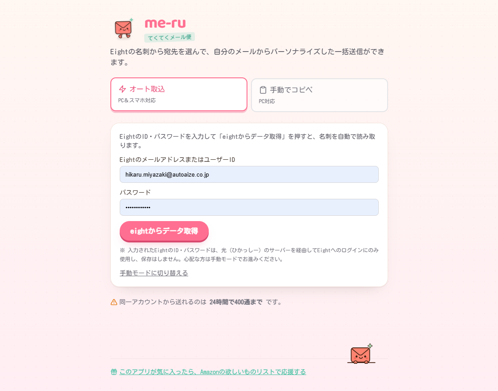
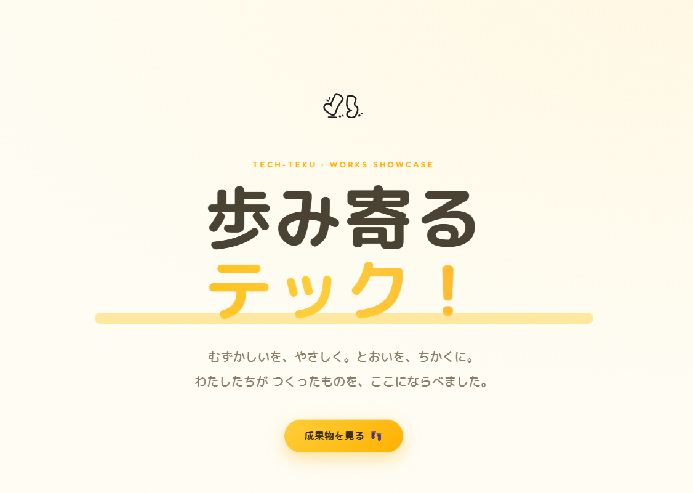

<h1 align="center"> TECH-TEKU（てっくてく）</h1>

わくわくする作品、てくてく作って歩いてます！🌟

  

 
<h2 align="center"> me-ru.tech-teku.com </h2>

  
  
 Eightの名刺情報を取り込んで、メールを一斉送信できるWebアプリ！

  

 
<h2 align="center">TECH-TEKU.COM</h2>

  
  
 作品たちを仲間に使ってもらうためのアクセスハブ 
     友達に頼まれたツールも、世に出したい作品も、ぜんぶここに集まります！

  <table>
    <tr>
      <td align="center"> <strong>me-ru</strong> 公開中！</td>
      <td align="center">🔜 <strong>moAI</strong> 仕込み中…</td>
      <td align="center">🔜 <strong>？？？</strong> おたのしみ</td>
    </tr>
  </table>
  

 
<h2 align="center">⭐1000個への道</h2>

  
  
 目標は☆1000個！！

<h2 align="center">  中の人</h2>

  
駆け出しエンジニア。毎日コツコツ、てくてく歩いてます。 
     便利なもの、面白いもの、誰かの役に立つもの—— 
     どんどん積み上げてくので、楽しみにしててね！

    
  

